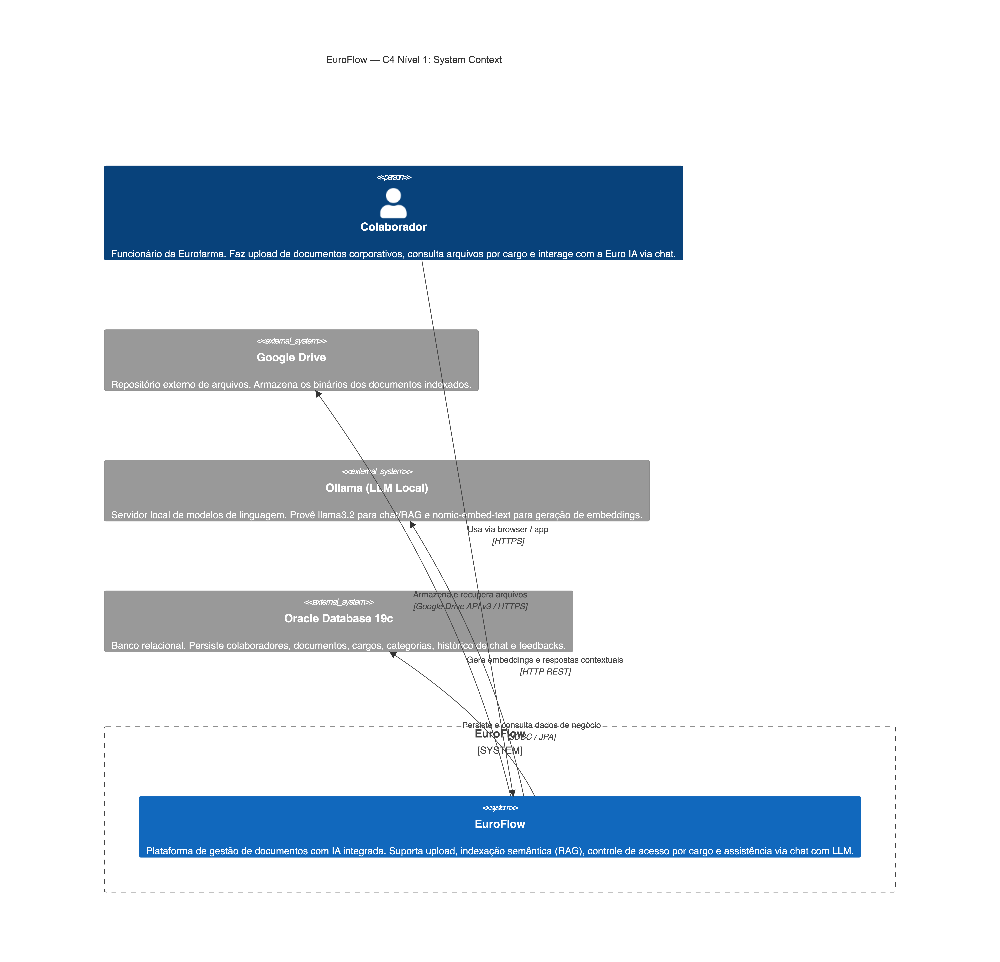
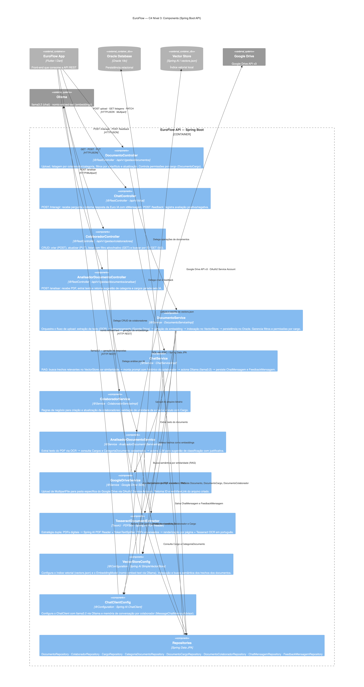
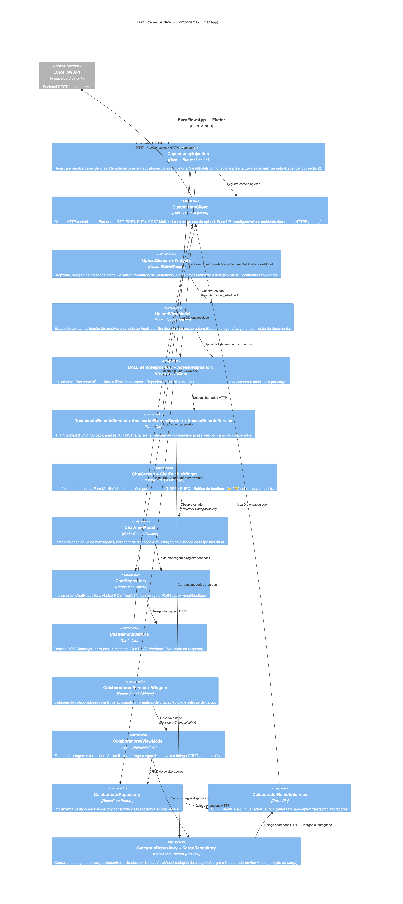

# EuroFlow — Diagramas C4 em Mermaid

> **Sistema:** Plataforma de gestão de documentos corporativos com IA — Eurofarma
> **Stack:** Flutter (Web/Mobile) · Spring Boot 3 / Java 17 · Oracle 19c · Ollama · Google Drive

---

## C4 — Nível 1: System Context

> **Objetivo:** mostrar quem usa o sistema e com quais sistemas externos ele se comunica.

---

## C4 — Nível 2: Container

> **Objetivo:** detalhar os contêineres de software que compõem o sistema e suas responsabilidades.

---

## C4 — Nível 3: Component — EuroFlow API (Spring Boot)

> **Objetivo:** detalhar os componentes internos do back-end, organizados por camada arquitetural.

---

## C4 — Nível 3: Component — EuroFlow App (Flutter)

> **Objetivo:** detalhar os componentes internos do front-end, organizados por camada MVVM e feature.

---

## Referência Rápida — Elementos C4 usados

| Símbolo | Significado |
|---|---|
| `Person` | Ator humano que interage com o sistema |
| `System` / `System_Ext` | Sistema interno / externo ao escopo |
| `Container` / `ContainerDb` | Unidade executável / banco de dados dentro do sistema |
| `Component` | Componente interno de um container (classe, módulo, serviço) |
| `Boundary` | Fronteira visual (sistema, container, empresa) |
| `Rel` | Dependência ou chamada entre elementos |
| `_Ext` (sufixo) | Elemento fora da fronteira do sistema sob análise |